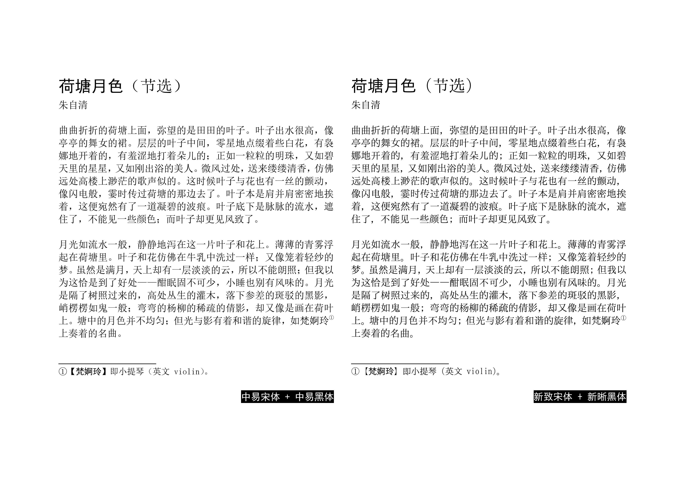

# 新晰黑体＆新致宋体 SimXiHei & SimZhiSong

「霞鹜新晰黑」「霞鹜新致宋」兼容 Windows 内置「黑体」「宋体」度量数据和字符集的版本，基于 IPA Gothic、IPA Mincho 衍生。

## 字体简介

「新晰黑体 / SimXiHei」「新致宋体 / SimZhiSong」是[「霞鹜新晰黑」](https://github.com/lxgw/LxgwNeoXiHei)[「霞鹜新致宋」](https://github.com/lxgw/LxgwNeoZhiSong)的分支版本，兼容 Windows 系统「黑体」「宋体」度量参数，采用 GBK 字符集。该字体可以让已经使用 Windows 系统「黑体」「宋体」的文档可以直接套换「新晰黑体」「新致宋体」而不会出现大面积重新排版的现象，可视为 Windows 系统「黑体」「宋体」的开源度量兼容（metric compatible）版本。

### 制作与调整

「新晰黑体」和「新致宋体」分别基于 IPA Gothic 和 IPA Mincho 衍生，在保留原字体等宽西文以及全宽西里尔字母、希腊字母的同时，将汉字和全角标点替换为「霞鹜新晰黑」和「霞鹜新致宋」的字形，并参照 v3.12 版本「宋体」调整了收字范围，使其符合 GBK 字符集。

至于度量数据，Windows「宋体」「黑体」的 UPM 为 256，而「新致宋体」「新晰黑体」的 UPM 为 2048，因此并不是直接照搬前者的度量数据，而是将前者的度量数据扩大到 8 倍再应用于后者。

### 字汇

「新致宋体」「新晰黑体」参照 Windows XP（Service Pack 3）内置的 v3.12 版本宋体调整了收字范围，包含《汉字内码扩展规范（技监标函〔1995〕229 号）》（简称 GBK）所收录的 21003 个汉字和 883 个图形符号，位于 Unicode 私用区的 106 个字符在两款字体中都增加了正式码位映射，同时保留私用区码位兼容（〝一字双码〞）。

此外也包含少量其他拉丁字符，如拉丁文字西欧语言补充区（`U+00A0`～`U+00FF`）的字符，以及 Windows 西欧字符集所收录的字符（€‚ƒ„…†‡ˆ‰Š‹Œ‘’“”•–—˜™š›œŸ）等。

### 概览

下图为 Windows 系统内置「宋体」「黑体」与「新致宋体」「新晰黑体」在 Word（Microsoft 365）中的排版对比，其中标题为 20 磅，作者署名和正文为小四号（12 磅），注释为五号（10.5 磅），均为单倍行距。

## 获取字体

进入 [Releases](https://github.com/lxgw/SimXiZhi/releases) 页面下载。

## 注意事项

1. 「新晰黑体」「新致宋体」中的字符宽度与 Windows「黑体」「宋体」的字符宽度并不完全相同，因此在替换文档内的 Windows「黑体」「宋体」时仍可能出现部分字符跑位移动的情况。
2. 由于「霞鹜新晰黑」「霞鹜新致宋」并没有补完 CJK 统一表意文字扩展 A 区（也没有计划补完），「新晰黑体」「新致宋体」并没有采用 GB 18030-2022（实现级别 1～2）字符集；此外也是为了向历史版本 Windows「黑体」「宋体」的字符集看齐，所以「新晰黑体」「新致宋体」剔除了 GBK 收录范围以外的汉字。
3. 为了更加契合 Windows「黑体」西文风格，「新晰黑体」的等宽西文并未按照常见于代码编辑的等宽西文字体作调整，保留 IPA Gothic 原始设计，惟「傻瓜引号」`"` `'`作了调整。

## 授权信息

- 本字体在 IPA 所开发并发布的 [IPA 字体](https://moji.or.jp/ipafont)基础上衍生，依照 [IPA开放字型授权条款 第1.0版（IPA Font License 1.0）](https://opensource.org/licenses/IPA/) 授权。
- 您可以将本字体用于印刷品、数字文档、影视内容、海报广告、包装、出版物设计以及其他各种设计用途，包括商业和非商业用途；
  也可在本字体基础上继续改作衍生，惟衍生字体名称（包括程序名、文件名、字体名）不得包含「IPA」字样，且衍生字体须继承相同授权许可（故 IPA 字体授权许可与 SIL OFL 不兼容）。
- 根据 IPA Font License 1.0 有关条款，在没有邮费、存储媒介费用和手续费的情况下，须免费提供字体文件，不得将字体文件单独售卖。
- 如果您要将本字体替换回 IPA 原始授权字体，请从 [IPA 字体 Ver.003.03 下载页面](https://moji.or.jp/ipafont/ipa00303)获取原始授权字体「IPA ゴシック」和「IPA 明朝」。  
  对于涉及字体文件再分发的嵌入式应用（如应用程序、硬件设备、网页等嵌入），[请点击此处](https://github.com/lxgw/LxgwNeoXiHei/blob/main/documentation/embedding_instructions.md)（跳转到「霞鹜新晰黑」repo）。
- 有关 IPA Font License 1.0 的其他常见问题，请参阅 [FAQ（日语）](https://moji.or.jp/ipafont/faq)，需自备翻译工具。
- 但凡有任何人使用、复制、修改、分发本字体，或对本字体进行任何符合 IPA Font License 1.0 规定的行为，使用、下载或行使合约规定权利之接受方，亦视为同意遵守 IPA Font License 1.0 的一切规定。  
  「IPA 字体（IPA Font，IPAフォント）」为日本「独立行政法人　信息处理推进机构」（The Information-Technology Promotion Agency, “IPA”）的注册商标。

## 参考资料

- [一点明体（新一细明体）](https://github.com/ichitenfont/I.Ming)
- [Takaoka Fonts](https://github.com/hidekatsu-izuno/takaoka-fonts)

## 更多「霞鹜」系列字体

### 「晰致尚铭」系列

- [霞鹜新晰黑 / LXGW Neo XiHei](https://github.com/lxgw/LxgwNeoXiHei)
- [霞鹜新致宋 / LXGW Neo ZhiSong](https://github.com/lxgw/LxgwNeoZhiSong)
- [霞鹜晰黑 / LXGW XiHei](https://github.com/lxgw/LxgwXiHei)
- [霞鹜致宋 / LXGW ZhiSong](https://github.com/lxgw/LxgwZhiSong)
- [霞鹜尚智黑 / LXGW Fasmart Gothic](https://github.com/lxgw/LxgwFasmartGothic)
- [霞鹜铭心宋 / LXGW Heart Serif](https://github.com/lxgw/LxgwHeartSerif)

### 「霞鹜文楷」系列

- [霞鹜文楷 / LXGW WenKai](https://github.com/lxgw/LxgwWenKai) | [Lite](https://github.com/lxgw/LxgwWenKai-Lite)
- [霞鹜文楷 GB / LXGW WenKai GB](https://github.com/lxgw/LxgwWenKaiGB) | [Lite](https://github.com/lxgw/LxgwWenKaiGB-Lite)
- [霞鹜文楷 TC / LXGW WenKai TC](https://github.com/lxgw/LxgwWenKaiTC)

### 其他

- [霞鹜漫黑 / LXGW Marker Gothic](https://github.com/lxgw/LxgwMarkerGothic)
- [小赖字体 / Xiaolai](https://github.com/lxgw/kose-font)
- [悠哉字体 / Yozai](https://github.com/lxgw/yozai-font)
